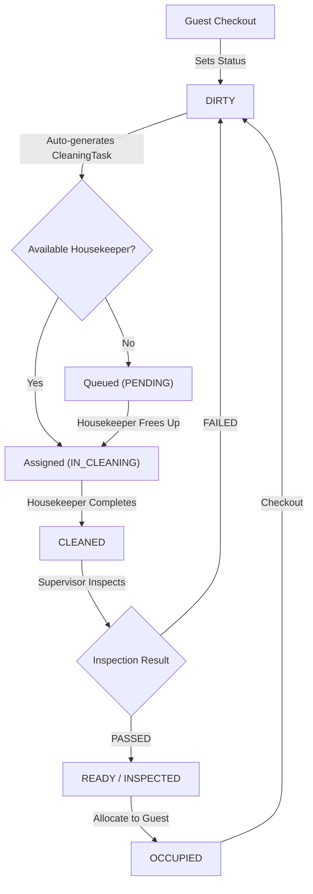
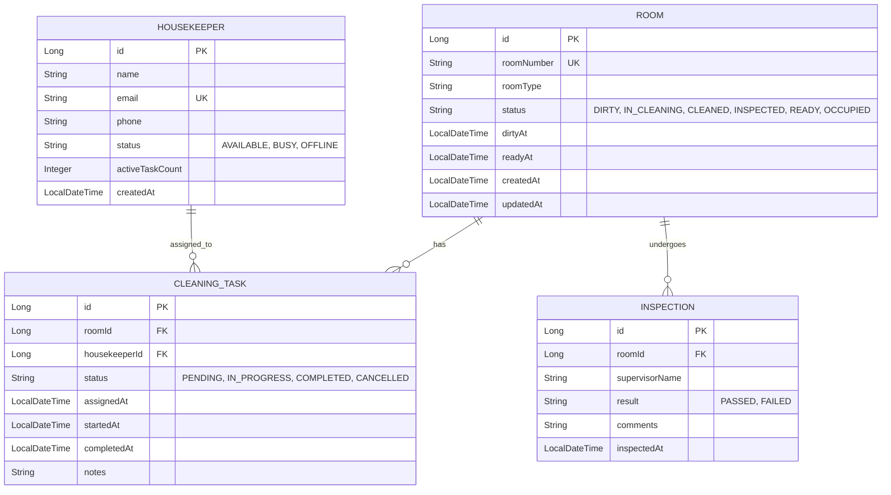

# Implementation Plan - HouseKeepTrack Backend System

HouseKeepTrack is a Spring Boot backend system for hotel housekeeping operations. It automates room status tracking across the post-checkout lifecycle, dynamically assigns cleaning tasks to available housekeepers, enforces strict inspection verification before check-in readiness, and provides turnaround time and workload metrics.

---

## User Review Required

> [!IMPORTANT]
> **MySQL Database Authentication & Database Name**:
> The local Windows service `MySQL80` is active. By default, the plan proposes using:
> - **Host & Port**: `localhost:3306`
> - **Database**: `housekeeptrack_db`
> - **Username**: `root`
> - **Password**: Default empty or configurable via `application.properties` / environment variable.
>
> If you have a specific password or user credentials set for your local MySQL instance, please provide them.

> [!NOTE]
> **Room Status Transitions & Invariants**:
> - Defined Lifecycle: `OCCUPIED` (guest in room) $\rightarrow$ `DIRTY` (checkout) $\rightarrow$ `IN_CLEANING` (task in progress) $\rightarrow$ `CLEANED` (housekeeper completed) $\rightarrow$ `INSPECTED` / `READY` (supervisor passed) $\rightarrow$ `OCCUPIED` (guest checked in).
> - Inspection Failure: If an inspection fails, status reverts from `CLEANED` back to `DIRTY` (with a high-priority cleaning task regenerated and re-assigned).
> - Check-in Barrier: Check-in / allocation to guest is strictly prohibited unless room status is `READY`.

---

## Open Questions

> [!WARNING]
> 1. **Auto-Assignment Strategy when no housekeeper is available**:
>    - **Proposed behavior**: When a room becomes dirty but all housekeepers are busy (`activeTaskCount >= 1` or status `BUSY`), the task is marked as `PENDING`. As soon as a housekeeper finishes an active task, the system automatically pulls the oldest pending task and assigns it. Please confirm if this queuing mechanism suits your requirements.
> 2. **Supervisor Inspection Flow**:
>    - Does a passed inspection directly transition the room to `READY`, or should the supervisor have an explicit two-step approval (`INSPECTED`, followed by an explicit `markReady` action)?
>    - **Proposed default**: Passing inspection sets status to `READY` immediately (while recording the `Inspection` record with `PASSED`), with an optional explicit `markReady` endpoint if held in `INSPECTED`.

---

## Architecture & System Design

### Entity Relationship Diagram

---

## Proposed Changes

### Component 1: Project Initialization & Build Setup
- Initialize Spring Boot 3.x project with Maven in `housekeeptrack/`:
  - **Dependencies**: `spring-boot-starter-web`, `spring-boot-starter-data-jpa`, `spring-boot-starter-validation`, `mysql-connector-j`, `lombok` (optional or standard POJOs).
  - Configure `pom.xml` for Java 25 compatibility.
  - Set up `application.properties` with MySQL connection string, Hibernate `ddl-auto: update`, and logging.

---

### Component 2: Domain Entities & Enums
#### [NEW] `com.housekeeptrack.entity.Room`
- Fields: `id`, `roomNumber`, `roomType`, `status` (`RoomStatus`), `dirtyAt`, `readyAt`, timestamps.
#### [NEW] `com.housekeeptrack.entity.Housekeeper`
- Fields: `id`, `name`, `email`, `phone`, `status` (`HousekeeperStatus`), `activeTaskCount`.
#### [NEW] `com.housekeeptrack.entity.CleaningTask`
- Fields: `id`, `room`, `housekeeper`, `status` (`TaskStatus`), `assignedAt`, `startedAt`, `completedAt`, `notes`.
#### [NEW] `com.housekeeptrack.entity.Inspection`
- Fields: `id`, `room`, `supervisorName`, `result` (`InspectionResult`), `comments`, `inspectedAt`.
#### [NEW] Enums:
- `RoomStatus`: `DIRTY`, `IN_CLEANING`, `CLEANED`, `INSPECTED`, `READY`, `OCCUPIED`.
- `HousekeeperStatus`: `AVAILABLE`, `BUSY`, `OFFLINE`.
- `TaskStatus`: `PENDING`, `IN_PROGRESS`, `COMPLETED`, `CANCELLED`.
- `InspectionResult`: `PASSED`, `FAILED`.

---

### Component 3: Repositories
#### [NEW] `RoomRepository`
- `findByStatus(RoomStatus status)`
- `findByRoomNumber(String roomNumber)`
#### [NEW] `HousekeeperRepository`
- `findFirstByStatusOrderByActiveTaskCountAsc(HousekeeperStatus status)`
- `findByStatus(HousekeeperStatus status)`
#### [NEW] `CleaningTaskRepository`
- `findTopByRoomIdAndStatus(Long roomId, TaskStatus status)`
- `findByHousekeeperId(Long housekeeperId)`
- `findTopByStatusOrderByAssignedAtAsc(TaskStatus status)`
#### [NEW] `InspectionRepository`
- `findByRoomIdOrderByInspectedAtDesc(Long roomId)`

---

### Component 4: Service Layer & Business Invariant Enforcement
#### [NEW] `RoomService`
- `markCheckout(Long roomId)`: Moves room to `DIRTY`, records `dirtyAt`, and triggers `CleaningTaskService.autoAssignTask(room)`.
- `allocateGuest(Long roomId)`: Validates status is `READY`. If not `READY`, throws `BusinessRuleException` ("Cannot allocate room unless status is READY"). Moves room to `OCCUPIED`.
- `getRoomTurnaroundMetrics()`: Calculates average time elapsed between `dirtyAt` and `readyAt` across rooms.
#### [NEW] `CleaningTaskService`
- `autoAssignTask(Room room)`: Finds an `AVAILABLE` housekeeper with lowest workload. If found, assigns task and updates room to `IN_CLEANING`. If none available, creates task in `PENDING` queue.
- `startTask(Long taskId)`: Sets `startedAt` and updates status to `IN_PROGRESS`.
- `completeTask(Long taskId)`: Marks task `COMPLETED`, records `completedAt`, updates housekeeper's workload, transitions room status to `CLEANED`, and checks if any `PENDING` tasks can be assigned to the freed housekeeper.
#### [NEW] `InspectionService`
- `inspectRoom(Long roomId, InspectionRequest request)`:
  - Verifies room is in `CLEANED` status.
  - If `PASSED`: Marks room as `INSPECTED` / `READY`, records `readyAt`.
  - If `FAILED`: Records failure notes, reverts room status to `DIRTY`, auto-generates a new `CleaningTask` with priority.
#### [NEW] `HousekeeperService`
- `createHousekeeper()`, `getWorkload()`, `getAverageCleaningTime(Long housekeeperId)`.

---

### Component 5: DTOs, Controllers & Exception Handling
#### [NEW] REST Controllers:
1. `RoomController`:
   - `POST /api/rooms` - Register new room.
   - `GET /api/rooms` - List rooms (filterable by status).
   - `POST /api/rooms/{id}/checkout` - Mark room as checkout / dirty.
   - `POST /api/rooms/{id}/allocate` - Allocate room to guest (enforces ready rule).
   - `GET /api/rooms/metrics/turnaround` - View average room turnaround time.
2. `CleaningTaskController`:
   - `POST /api/tasks/{id}/start` - Housekeeper starts task.
   - `POST /api/tasks/{id}/complete` - Housekeeper completes task.
   - `GET /api/tasks` - List tasks by status/housekeeper.
3. `InspectionController`:
   - `POST /api/rooms/{id}/inspect` - Supervisor inspects room (pass/fail).
4. `HousekeeperController`:
   - `POST /api/housekeepers` - Register housekeeper.
   - `GET /api/housekeepers/workload` - View housekeepers and their active workloads & metrics.
#### [NEW] `GlobalExceptionHandler`:
- Handles `BusinessRuleException` $\rightarrow$ returns HTTP 400/409 with clean `{ "timestamp", "status", "error", "message" }`.
- Handles `ResourceNotFoundException` $\rightarrow$ returns HTTP 404.
- Handles `MethodArgumentNotValidException` $\rightarrow$ returns HTTP 400 with field-level validation errors.

---

## Verification Plan

### Automated Tests
1. **Repository & Service Unit Tests**:
   - Verify room status forward-only progression.
   - Verify room allocation fails with 400/409 if room is `DIRTY`, `IN_CLEANING`, or `CLEANED`.
   - Verify failed inspection sends room back to `DIRTY` and creates new `CleaningTask`.
   - Verify successful inspection marks room `READY`.
   - Verify housekeeper assignment updates workload count.
2. **Build and Test Command**:
   - `mvn clean test`

### Manual / API Verification (Postman / cURL)
1. **Create Room & Housekeeper**:
   - `POST /api/rooms` with room 101.
   - `POST /api/housekeepers` with housekeeper "Alice".
2. **Checkout Flow**:
   - `POST /api/rooms/1/checkout` $\rightarrow$ verify room is `DIRTY` / `IN_CLEANING`, task assigned to Alice.
3. **Invalid Check-in Attempt**:
   - `POST /api/rooms/1/allocate` $\rightarrow$ verify response is HTTP 400 with message "Cannot allocate room: status is IN_CLEANING, must be READY".
4. **Complete Cleaning**:
   - `POST /api/tasks/1/complete` $\rightarrow$ verify room becomes `CLEANED`, Alice workload decrements.
5. **Fail Inspection Edge Case**:
   - `POST /api/rooms/1/inspect` with result `FAILED` $\rightarrow$ verify room reverts to `DIRTY`, new task generated.
6. **Pass Inspection & Allocation**:
   - Clean again, then `POST /api/rooms/1/inspect` with result `PASSED` $\rightarrow$ verify room is `READY`.
   - `POST /api/rooms/1/allocate` $\rightarrow$ verify room transitions to `OCCUPIED`.
7. **Metrics Check**:
   - `GET /api/rooms/metrics/turnaround` and `GET /api/housekeepers/workload`.
