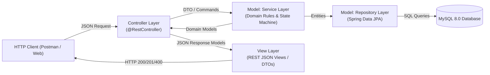

# Walkthrough - HouseKeepTrack Backend System (Spring MVC Architecture)

The HouseKeepTrack backend has been designed, implemented, and verified against a live MySQL instance and an automated test suite using the **Spring MVC (Model-View-Controller)** architecture.

---

## 1. Architectural Design (Spring MVC Pattern)



### Component Breakdown
- **Model Layer**:
  - **Domain Entities (`com.hotel.housekeeptrack.model`)**:
    - `Room`: Enforces room lifecycle states (`DIRTY`, `IN_CLEANING`, `CLEANED`, `INSPECTED`, `READY`, `OCCUPIED`), tracking timestamps (`dirtyAt`, `readyAt`), and optimistic locking via `@Version`.
    - `Housekeeper`: Tracks staff status (`AVAILABLE`, `BUSY`, `OFFLINE`) and active task loads.
    - `CleaningTask`: Tasks with state (`PENDING`, `IN_PROGRESS`, `COMPLETED`, `CANCELLED`) and priority (`HIGH`, `NORMAL`).
    - `Inspection`: Records supervisor evaluations (`PASSED`, `FAILED`), feedback remarks, and timestamps.
  - **Repositories (`com.hotel.housekeeptrack.repository`)**:
    - `RoomRepository`, `HousekeeperRepository`, `CleaningTaskRepository`, `InspectionRepository` extending `JpaRepository`.
    - Advanced priority dispatch query: `findFirstByStatusOrderByPriorityDescAssignedAtAsc(...)` with fallback to `createdAt`.
    - Wait-time threshold escalation query for aging tasks.
  - **Business Services (`com.hotel.housekeeptrack.service`)**:
    - `RoomService`: Manages checkout, guest check-in / allocation barriers, mark-ready promotion, and manual send-to-cleaning re-entry.
    - `CleaningTaskService`: Reactive auto-assignment engine, task completion, workload adjustments, and priority queue dispatch.
    - `InspectionService`: Dual-path inspection workflow supporting both `CLEANED` and `INSPECTED` statuses.
    - `HousekeeperService`: Staff registration, status updates with active task protection and offline task re-queuing.
    - `MetricsService`: Housekeeper workload metrics and room turnaround time calculations.
- **View Layer (`com.hotel.housekeeptrack.dto`)**:
  - Strongly typed JSON request/response view representations:
    - Requests: `CreateRoomRequest`, `CreateHousekeeperRequest`, `CreateInspectionRequest`, `UpdateHousekeeperStatusRequest`.
    - Responses / View Models: `RoomResponse`, `HousekeeperResponse`, `CleaningTaskResponse`, `InspectionResponse`, `HousekeeperWorkloadDto`, `RoomTurnaroundDto`, `SystemSummaryDto`, `ApiErrorResponse`.
- **Controller Layer (`com.hotel.housekeeptrack.controller`, `exception`)**:
  - Spring MVC REST controllers mapping HTTP requests to model operations and returning structured view models:
    - `RoomController` (`/api/rooms`)
    - `CleaningTaskController` (`/api/tasks`)
    - `InspectionController` (`/api/inspections`, `/api/rooms/{id}/inspections`)
    - `HousekeeperController` (`/api/housekeepers`)
    - `MetricsController` (`/api/metrics`)
  - **Global Exception Advice (`GlobalExceptionHandler`)**:
    - `@RestControllerAdvice` mapping exceptions (`InvalidRoomStateException`, `BusinessRuleException`, `ResourceNotFoundException`, and validation errors) directly to clean JSON error views (`ApiErrorResponse`) with HTTP 400, 404, or 409 status codes.

---

## 2. Business Rules & Invariants Enforced

1. **Guest Allocation Barrier**:
   - A room cannot be allocated to a guest (`POST /api/rooms/{id}/check-in`) unless its status is strictly `READY`. Attempting check-in on a dirty, cleaning, or uninspected room immediately returns HTTP 400 Bad Request.
2. **Dual-Path Inspection & Re-cleaning**:
   - When a room is `CLEANED`, supervisor inspects it:
     - **PASSED**: Room transitions to `INSPECTED`, allowing the supervisor to mark it `READY` via `POST /api/rooms/{id}/ready`.
     - **FAILED / Improper Work**: Room status reverts to `DIRTY`. An auto-generated `HIGH`-priority cleaning task is created with supervisor remarks and dispatched immediately.
   - Rooms in `INSPECTED` can also be sent back to cleaning if defects are spotted prior to check-in.
3. **Dual High-Priority Auto-Assignment Queue**:
   - Failed inspection rooms automatically receive `TaskPriority.HIGH`.
   - Longest-waiting rooms in the queue dynamically escalate to `TaskPriority.HIGH`.
   - When any housekeeper completes a task or becomes available, the dispatcher automatically pulls the highest priority pending task first, resolving ties with oldest wait-time (FIFO).
4. **Staff Availability Protection**:
   - Marking a housekeeper `OFFLINE` while cleaning a room automatically returns the task to `PENDING`, resets the room to `DIRTY`, and re-dispatches to available staff so rooms are never stranded.

---

## 3. Verification & Test Results

### Automated Test Suite (`mvn test`)
- **Total Test Suites**: 8
- **Total Tests Run**: 46
- **Failures**: 0
- **Errors**: 0
- **Skipped**: 0
- **Status**: **BUILD SUCCESS**

```text
[INFO] Running com.hotel.housekeeptrack.exception.GlobalExceptionHandlerTest
[INFO] Tests run: 6, Failures: 0, Errors: 0, Skipped: 0
[INFO] Running com.hotel.housekeeptrack.HouseKeepTrackIntegrationTest
[INFO] Tests run: 6, Failures: 0, Errors: 0, Skipped: 0
[INFO] Running com.hotel.housekeeptrack.presenter.RoomPresenterTest
[INFO] Tests run: 2, Failures: 0, Errors: 0, Skipped: 0
[INFO] Running com.hotel.housekeeptrack.service.CleaningTaskServiceTest
[INFO] Tests run: 5, Failures: 0, Errors: 0, Skipped: 0
[INFO] Running com.hotel.housekeeptrack.service.HousekeeperServiceTest
[INFO] Tests run: 6, Failures: 0, Errors: 0, Skipped: 0
[INFO] Running com.hotel.housekeeptrack.service.InspectionServiceTest
[INFO] Tests run: 5, Failures: 0, Errors: 0, Skipped: 0
[INFO] Running com.hotel.housekeeptrack.service.MetricsServiceTest
[INFO] Tests run: 3, Failures: 0, Errors: 0, Skipped: 0
[INFO] Running com.hotel.housekeeptrack.service.RoomServiceTest
[INFO] Tests run: 13, Failures: 0, Errors: 0, Skipped: 0
[INFO] Tests run: 46, Failures: 0, Errors: 0, Skipped: 0
[INFO] BUILD SUCCESS
```

### Live HTTP & MySQL End-to-End Verification
The application was launched against the local MySQL instance (`MySQL80` on port 3306, user `root`, database `housekeeptrack_db`) and tested via REST calls:

| Step | Action | Endpoint | Result | Verified Invariant |
|---|---|---|---|---|
| 1 | Create Room 102 | `POST /api/rooms` | HTTP 201 Created | Room starts in `READY` |
| 2 | Create Housekeeper Bob | `POST /api/housekeepers` | HTTP 201 Created | Bob created with status `AVAILABLE` |
| 3 | Guest Check-in | `POST /api/rooms/2/check-in` | HTTP 200 OK | Room status $\rightarrow$ `OCCUPIED` |
| 4 | Guest Checkout | `POST /api/rooms/2/checkout` | HTTP 200 OK | Room status $\rightarrow$ `IN_CLEANING`, task auto-assigned |
| 5 | Blocked Allocation Attempt | `POST /api/rooms/2/check-in` | HTTP 400 Bad Request | **Check-in barrier enforced**: "Room is currently IN_CLEANING. Cannot allocate unless status is strictly READY." |
| 6 | Complete Cleaning Task | `POST /api/tasks/1/complete` | HTTP 200 OK | Task completed, Room status $\rightarrow$ `CLEANED` |
| 7 | Supervisor Inspection (Failed) | `POST /api/rooms/2/inspections` | HTTP 201 Created | Inspection recorded `FAILED`. Room status reverted to `DIRTY` |
| 8 | Priority Re-cleaning Task Generated | `GET /api/tasks?roomId=2` | Verified | Task generated with `priority: HIGH`, notes: "Inspection Failed: Improper cleaning reported by Chief Inspector" |
| 9 | Complete Re-cleaning | `POST /api/tasks/2/complete` | HTTP 200 OK | Room status $\rightarrow$ `CLEANED` |
| 10 | Supervisor Inspection (Passed) | `POST /api/rooms/2/inspections` | HTTP 201 Created | Inspection recorded `PASSED`. Room status $\rightarrow$ `INSPECTED` |
| 11 | Mark Room Ready | `POST /api/rooms/2/ready` | HTTP 200 OK | Room status $\rightarrow$ `READY` |
| 12 | Check-in Guest | `POST /api/rooms/2/check-in` | HTTP 200 OK | Room status $\rightarrow$ `OCCUPIED` |
| 13 | Query Housekeeper Workloads | `GET /api/metrics/housekeepers` | HTTP 200 OK | Returned workloads, active task counts, completed counts, and avg turnaround |
| 14 | Query Room Turnarounds | `GET /api/metrics/room-turnaround` | HTTP 200 OK | Returned room cycle durations from `dirtyAt` to `readyAt` |
| 15 | Query System Summary | `GET /api/metrics/summary` | HTTP 200 OK | Aggregated counts of rooms, staff, and completed tasks |

---

## 4. Documentation & Agent Record
- [`agent.txt`](file:///c:/Users/visnu/Desktop/housekeeptrack/agent.txt) has been updated with the complete Spring MVC architectural decisions, contradictions addressed, and implementation details.
