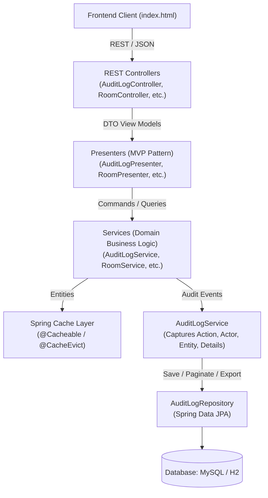

# Walkthrough - HouseKeepTrack: Operational Audit Logging, Multi-Format Download & Caching

The HouseKeepTrack system has been extended with comprehensive **Audit Logging & Multi-Format Download Export**, **Spring Cache Integration**, **Pagination and Sorting**, and **Frontend UI Enhancements** (5-item table pagination with blinking page number alerts and a format picker modal).

---

## 1. Architectural Changes & Component Summary



### Components Implemented:
1. **Audit Logging Domain & Persistence**:
   - [`AuditAction`](file:///c:/Users/visnu/Desktop/housekeeptrack/src/main/java/com/hotel/housekeeptrack/model/AuditAction.java): Enum covering `ROOM_CREATED`, `CHECK_IN`, `CHECKOUT`, `MARK_READY`, `SEND_TO_CLEANING`, `TASK_ASSIGNED`, `TASK_COMPLETED`, `INSPECTION_PASSED`, `INSPECTION_FAILED`, `STAFF_REGISTERED`, `STAFF_STATUS_CHANGED`.
   - [`AuditLog`](file:///c:/Users/visnu/Desktop/housekeeptrack/src/main/java/com/hotel/housekeeptrack/model/AuditLog.java): Entity with `id`, `timestamp`, `action`, `entityType`, `entityId`, `actor`, `details`.
   - [`AuditLogRepository`](file:///c:/Users/visnu/Desktop/housekeeptrack/src/main/java/com/hotel/housekeeptrack/repository/AuditLogRepository.java): Extends `JpaRepository<AuditLog, Long>` with `Pageable` support, `findAllByOrderByTimestampAsc()`, and `findAllByOrderByTimestampDesc(Pageable)`.
   - [`AuditLogService`](file:///c:/Users/visnu/Desktop/housekeeptrack/src/main/java/com/hotel/housekeeptrack/service/AuditLogService.java): Captures audit events, provides paginated access, and generates formatted Markdown and Plain Text reports.
   - Lifecycle Hooks: Integrated into [`RoomService`](file:///c:/Users/visnu/Desktop/housekeeptrack/src/main/java/com/hotel/housekeeptrack/service/RoomService.java), [`CleaningTaskService`](file:///c:/Users/visnu/Desktop/housekeeptrack/src/main/java/com/hotel/housekeeptrack/service/CleaningTaskService.java), [`InspectionService`](file:///c:/Users/visnu/Desktop/housekeeptrack/src/main/java/com/hotel/housekeeptrack/service/InspectionService.java), and [`HousekeeperService`](file:///c:/Users/visnu/Desktop/housekeeptrack/src/main/java/com/hotel/housekeeptrack/service/HousekeeperService.java).

2. **Audit Log Download REST API**:
   - [`AuditLogPresenter`](file:///c:/Users/visnu/Desktop/housekeeptrack/src/main/java/com/hotel/housekeeptrack/presenter/AuditLogPresenter.java): Coordinates JSON responses and generates file attachments with timestamps.
   - [`AuditLogController`](file:///c:/Users/visnu/Desktop/housekeeptrack/src/main/java/com/hotel/housekeeptrack/controller/AuditLogController.java):
     * `GET /api/audit-logs`: Returns `Page<AuditLogResponse>` (default size=5, sorted descending by timestamp).
     * `GET /api/audit-logs/download?format=md|txt`: Generates downloadable file with header `Content-Disposition: attachment; filename="housekeeptrack-audit-log-YYYYMMDD_HHmmss.[md|txt]"` and appropriate `Content-Type`.

3. **Spring Cache & Pagination/Sorting**:
   - Added `spring-boot-starter-cache` to [`pom.xml`](file:///c:/Users/visnu/Desktop/housekeeptrack/pom.xml) and `@EnableCaching` to [`HouseKeepTrackApplication`](file:///c:/Users/visnu/Desktop/housekeeptrack/src/main/java/com/hotel/housekeeptrack/HouseKeepTrackApplication.java).
   - `@Cacheable` applied to busiest read endpoints in [`MetricsService`](file:///c:/Users/visnu/Desktop/housekeeptrack/src/main/java/com/hotel/housekeeptrack/service/MetricsService.java) (`systemSummary`, `housekeeperWorkloads`, `roomTurnaround`) and [`RoomService`](file:///c:/Users/visnu/Desktop/housekeeptrack/src/main/java/com/hotel/housekeeptrack/service/RoomService.java) (`rooms`).
   - Fine-grained `@CacheEvict(allEntries = true)` on mutating state transitions.
   - Pageable and Sort support on [`RoomRepository`](file:///c:/Users/visnu/Desktop/housekeeptrack/src/main/java/com/hotel/housekeeptrack/repository/RoomRepository.java) and [`RoomController`](file:///c:/Users/visnu/Desktop/housekeeptrack/src/main/java/com/hotel/housekeeptrack/controller/RoomController.java).

4. **Frontend UI Enhancements ([`index.html`](file:///c:/Users/visnu/Desktop/housekeeptrack/src/main/resources/static/index.html))**:
   - **Single Download Button**: "📥 Download Audit Logs" in portal header and Audit section, launching a format picker modal asking for Markdown (.md) or Plain Text (.txt) before downloading.
   - **5-Item Table Pagination**: All tables (Rooms, Tasks, Staff, Inspections, Audit Trail) paginate with 5 entries per page, showing `« Prev`, numbered page buttons, and `Next »` controls.
   - **Blinking Page Number Alert**: When an unread change occurs on a page not currently being viewed (room becomes DIRTY, task queued, staff status change, new audit log), that page number button pulses with `@keyframes alertBlinkRedAmber` in red-amber until clicked and viewed.
   - **Operational Audit Trail Section**: Displays chronological audit log events with action badges, actor, entity ID, and event details.

---

## 2. Verification Record

### Automated Test Suite (`mvn clean test`)
- **Total Test Suites**: 10
- **Total Tests Run**: 55
- **Failures**: 0
- **Errors**: 0
- **Skipped**: 0
- **Status**: **BUILD SUCCESS**

```text
[INFO] Running com.hotel.housekeeptrack.controller.AuditLogControllerTest
[INFO] Tests run: 4, Failures: 0, Errors: 0, Skipped: 0
[INFO] Running com.hotel.housekeeptrack.exception.GlobalExceptionHandlerTest
[INFO] Tests run: 6, Failures: 0, Errors: 0, Skipped: 0
[INFO] Running com.hotel.housekeeptrack.HouseKeepTrackIntegrationTest
[INFO] Tests run: 7, Failures: 0, Errors: 0, Skipped: 0
[INFO] Running com.hotel.housekeeptrack.presenter.RoomPresenterTest
[INFO] Tests run: 2, Failures: 0, Errors: 0, Skipped: 0
[INFO] Running com.hotel.housekeeptrack.service.AuditLogServiceTest
[INFO] Tests run: 4, Failures: 0, Errors: 0, Skipped: 0
[INFO] Running com.hotel.housekeeptrack.service.CleaningTaskServiceTest
[INFO] Tests run: 5, Failures: 0, Errors: 0, Skipped: 0
[INFO] Running com.hotel.housekeeptrack.service.HousekeeperServiceTest
[INFO] Tests run: 6, Failures: 0, Errors: 0, Skipped: 0
[INFO] Running com.hotel.housekeeptrack.service.InspectionServiceTest
[INFO] Tests run: 5, Failures: 0, Errors: 0, Skipped: 0
[INFO] Running com.hotel.housekeeptrack.service.MetricsServiceTest
[INFO] Tests run: 3, Failures: 0, Errors: 0, Skipped: 0
[INFO] Running com.hotel.housekeeptrack.service.RoomServiceTest
[INFO] Tests run: 13, Failures: 0, Errors: 0, Skipped: 0
[INFO] 
[INFO] Results:
[INFO] 
[INFO] Tests run: 55, Failures: 0, Errors: 0, Skipped: 0
[INFO] BUILD SUCCESS
```

---

## 3. Sample Export Formats

### Markdown Format (.md)
```markdown
# HouseKeepTrack - Operational Audit Log Report

**Export Date:** 2026-09-28 14:45:00  
**Total Entries:** 4  

| ID | Timestamp | Action | Entity Type | Entity ID | Actor | Details |
|:---|:---|:---|:---|:---|:---|:---|
| 1 | 2026-09-28 14:30:15 | ROOM_CREATED | Room | 506 | FrontDesk | Created SUITE room 506 |
| 2 | 2026-09-28 14:30:16 | STAFF_REGISTERED | Housekeeper | 1 | Admin | Registered housekeeper Audited Staff (Email: audit.staff@hotel.com) |
| 3 | 2026-09-28 14:30:18 | CHECK_IN | Room | 506 | FrontDesk | Guest checked into room 506 |
| 4 | 2026-09-28 14:30:20 | CHECKOUT | Room | 506 | FrontDesk | Guest checked out of room 506 |
```

### Plain Text Format (.txt)
```text
================================================================================
HOUSEKEEPTRACK - OPERATIONAL AUDIT TRAIL LOG REPORT
Export Date: 2026-09-28 14:45:00
Total Records: 4
================================================================================

[2026-09-28 14:30:15] [ROOM_CREATED] Entity: Room #506 | Actor: FrontDesk | Details: Created SUITE room 506
[2026-09-28 14:30:16] [STAFF_REGISTERED] Entity: Housekeeper #1 | Actor: Admin | Details: Registered housekeeper Audited Staff (Email: audit.staff@hotel.com)
[2026-09-28 14:30:18] [CHECK_IN] Entity: Room #506 | Actor: FrontDesk | Details: Guest checked into room 506
[2026-09-28 14:30:20] [CHECKOUT] Entity: Room #506 | Actor: FrontDesk | Details: Guest checked out of room 506

================================================================================
END OF AUDIT TRAIL REPORT
================================================================================
```
